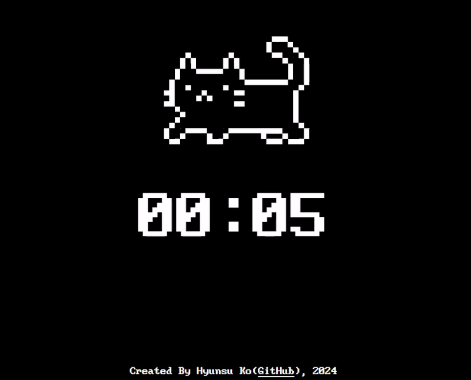

# Timer
Timer-equipped Website - Next.js



# How To Use
Use Query Parameters to Set Time Limits

#### `h` = Hour(s)
#### `m` = Minute(s)
#### `s` = Second(s)
#### `date` = YYYYMMDDhhmm Format
(`date` can't be used in conjunction with `h`, `m`, `s`) 

### Examples

- 10 Seconds

  `https://timer.scg.skku.ac.kr?s=10`

- 5 Minutes 

  `https://timer.scg.skku.ac.kr?m=5`

- 2 Hours 30 Minutes 5 Seconds
  
  `https://timer.scg.skku.ac.kr?h=2&m=30&s=5`

- D-Day 2030/12/25 09:00

  `https://timer.scg.skku.ac.kr?date=203012250900`

# How to Deploy

### Development Stage
```
npm install
npm run dev
```

### Production Stage
```
npm install
npm run build
npm run start
```